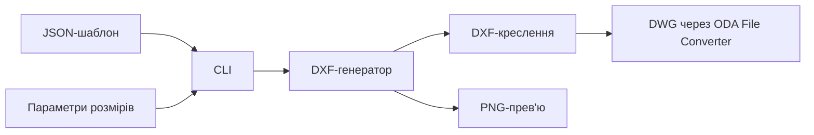
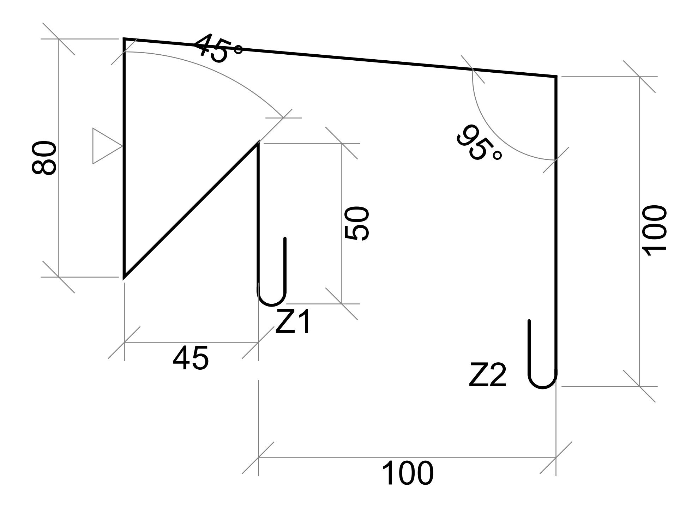
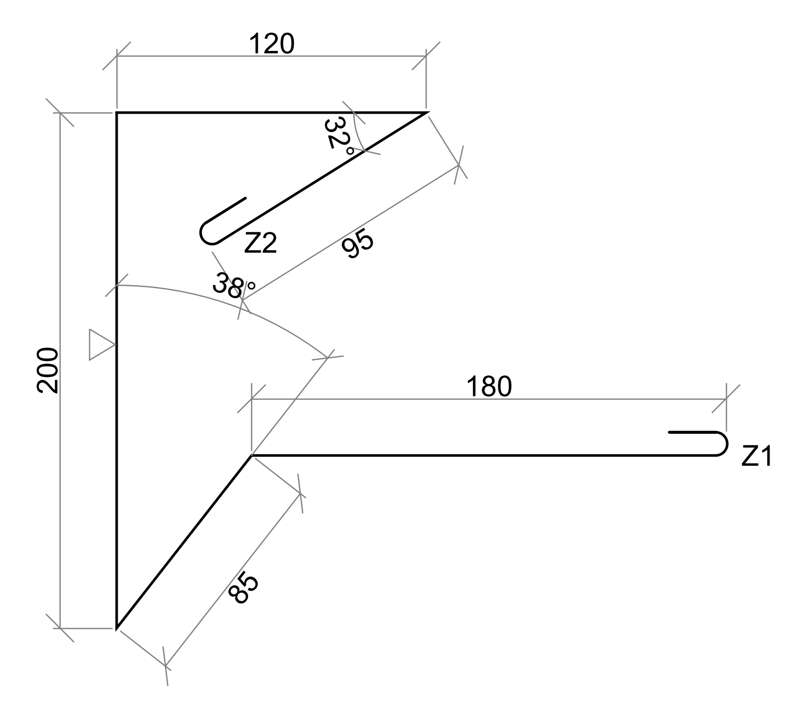

# PlankiGenerator

**PlankiGenerator** - консольний Python-інструмент для автоматичної генерації CAD-креслень металевих планок за параметричними JSON-шаблонами. Проєкт створює DXF-файли, PNG-прев'ю та, за наявності ODA File Converter, DWG-файли.

Проєкт можна показувати як приклад інженерної автоматизації: він перетворює набір розмірів на готове креслення з профілем, гачками, підписами, розмірними лініями, маркерами товщини та прев'ю.

## Можливості

- Генерація DXF-креслень за 36 готовими шаблонами `pl_1` - `pl_36`.
- Параметричні розміри через JSON: довжини, кути, додаткові відступи та значення `A`, `B`, `C`, `D`, `E`, `F`, `K1` тощо.
- Автоматична побудова профілю, гачків, дуг, кутів, виносних і розмірних ліній.
- Автоматичне розміщення підписів з урахуванням перешкод на кресленні.
- Маркери товщини та підписи ліній профілю.
- Експорт PNG-прев'ю та мініатюри `200x100`.
- Опціональна конвертація DXF у DWG через ODA File Converter.
- Інтерактивний режим, генерація одного шаблону та пакетна генерація з файлу команд.

## Стек

- **Python** - основна логіка генерації.
- **ezdxf** - створення DXF-документів.
- **matplotlib** - рендер DXF у PNG.
- **Pillow** - створення мініатюр.
- **ODA File Converter** - опціональна конвертація DXF у DWG.

## Як це працює



Основна логіка розділена на невеликі модулі: побудова профілю, розрахунок геометрії, відрисовка кутів, гачків, розмірних ліній, маркерів і підписів. Завдяки цьому нові шаблони можна додавати через JSON без переписування генератора з нуля.

## Структура проєкту

```text
.
|-- app/
|   |-- generator/          # модульна логіка побудови креслень
|   |-- dwg_converter.py    # конвертація DXF у DWG
|   |-- dxf_generator.py    # публічна точка генерації DXF
|   |-- file_storage.py     # шляхи для вихідних файлів
|   |-- png_generator.py    # генерація PNG-прев'ю
|   `-- templates.py        # завантаження JSON-шаблонів
|-- data/
|   |-- templates/          # шаблони pl_1 - pl_36
|   `-- output/             # створені DXF/DWG/PNG-файли
|-- comandes                # пакетний файл з параметрами генерації
|-- config.py               # налаштування шляхів і CAD-стилів
|-- generator_cli.py        # CLI та інтерактивний режим
|-- requirements.txt
`-- start_generator.bat     # запуск портативної Windows-версії
```

## Швидкий старт

### 1. Встановлення залежностей

```bash
pip install -r requirements.txt
```

### 2. Запуск інтерактивного режиму

```bash
python generator_cli.py
```

В інтерактивному режимі можна вибрати шаблон, ввести параметри та отримати готові файли в `data/output`.

### 3. Генерація одного креслення

```bash
python generator_cli.py --template pl_1 --param A=120 --param B=60 --param C=30 --param K1=90
```

Набір параметрів залежить від вибраного шаблону. CLI сам визначає параметри, які використовуються всередині JSON-шаблону.

### 4. Пакетна генерація

```bash
python generator_cli.py --all
```

За замовчуванням команда читає файл `comandes`. Також можна передати власний JSON-файл:

```bash
python generator_cli.py --file generation_request.json
```

Приклад структури файлу:

```json
[
  {
    "template_code": "pl_1",
    "parameters": {
      "A": 120,
      "B": 60,
      "C": 30,
      "K1": 90
    }
  }
]
```

## Результат генерації

Після запуску проєкт створює файли в `data/output`:

- `.dxf` - основне CAD-креслення;
- `.dwg` - DWG-версія, якщо встановлено ODA File Converter;
- `.png` - зображення креслення;
- `_100x200.png` - мініатюра для попереднього перегляду.

## Конвертація у DWG

DWG створюється лише якщо встановлено **ODA File Converter**. Шлях до конвертера задається в `config.py`:

```python
ODA_CONVERTER_EXE = Path(
    r"C:\Program Files\ODA\ODAFileConverter 27.1.0\ODAFileConverter.exe"
)
```

Якщо конвертер не знайдено, генерація не падає: проєкт просто зберігає DXF і PNG.

## Що демонструє проєкт

- Роботу з CAD-форматами та геометрією.
- Розділення великої генерації креслень на незалежні модулі.
- Параметричні шаблони на JSON.
- CLI-інтерфейс з інтерактивним і пакетним режимами.
- Обробку необов'язкової зовнішньої залежності без поломки основного сценарію.
- Підготовку портативного запуску для Windows.

## Можливі покращення

- Додати графічний інтерфейс для вибору шаблону та параметрів.
- Додати автоматичні тести для геометрії та шаблонів.
- Зберігати прев'ю шаблонів в окремій галереї.
- Додати Docker-оточення для відтворюваного запуску.
- Налаштувати CI-перевірки форматування та базової генерації.

## Приклади згенерованих креслень

### Шаблон pl_32



### Шаблон pl_28


